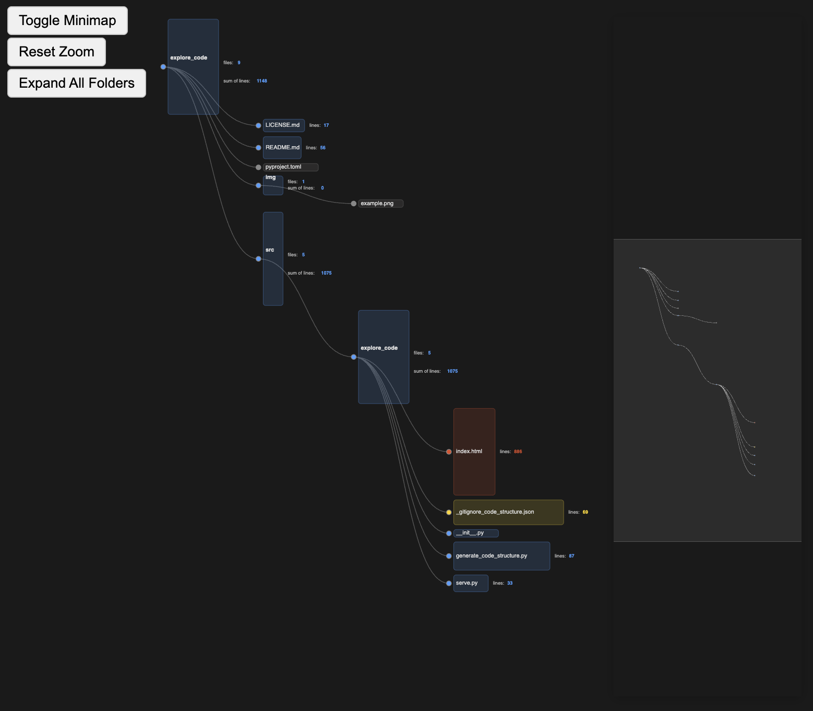

# 🧭 `xc` - Explore code

When exploring a new project:  
**get an overview of the folder & file structure**  
(see the organization of files and code).

This tool **shows all the structure**:




<br />

## How to use

**Step 1**

Install this package:
```bash
git clone https://github.com/VladimirFokow/explore_code.git
cd explore_code  # the root folder of this repo
pip install -e .
```

(For convenience) Set an alias, e.g. in `~/.bashrc`:
```bash
alias xc='python -m explore_code.serve'
# Or even (to automatically open the browser as well):
alias xc='open -a "Google Chrome" http://localhost:8000 & python -m explore_code.serve'  # for macOS
alias xc='xdg-open http://localhost:8000 & python -m explore_code.serve'  # for Linux
```

**Step 2**

Use:

```bash
cd any/folder
xc
```

or:

```bash
xc path/to/any/folder
```

✅ Open [http://localhost:8000](http://localhost:8000) in your browser.


<br />

## Features:

- zooming, panning
- clicking on a folder: collapses / expands it
- double clicking on a folder / file: copies its absolute path to clipboard
- files are sorted and colored by filetype
- size of box corresponds to number of lines
- hovering over a box: shows info


<br />

## TODO:

- make a VSCode extension out of this? - so that clicking on file box -> opens this file in VSCode (e.g. in the tab on the right)
- add ability for nice rules which files to include/exclude (by list of regexes? or maybe better: gitignore syntax?)


<br />

## Alternatives

- [`Crabviz`](https://marketplace.visualstudio.com/items?itemName=chanhx.crabviz): VSCode ext
- [`code2flow`](https://github.com/scottrogowski/code2flow): cli tool
- [`Graphviz Interactive Preview`](https://marketplace.visualstudio.com/items?itemName=tintinweb.graphviz-interactive-preview): VSCode ext
- [`Code Analyzer 2.0`](https://marketplace.visualstudio.com/items?itemName=SoftwareEvolutionLab.codeanalyzer2): VSCode ext, - uses `gitinspector`
- [`gitinspector`](https://github.com/ejwa/gitinspector): cli tool
- [`VS Code Counter`](https://marketplace.visualstudio.com/items?itemName=uctakeoff.vscode-counter): VSCode ext (no viz, but maybe I could use info from it for my viz)
- [`tinygrad/sz.py`](https://github.com/tinygrad/tinygrad/blob/master/sz.py): script, output in the terminal
- [`deepwiki.com`](https://deepwiki.com): if you replace `github.com` by `deepwiki.com` of any repo -> it generates explanations of the code structure

**Not** useful for Python in VSCode:
- [`Dependency Cruiser`](https://github.com/sverweij/dependency-cruiser): only JS ecosystem
- [`Code Graph`](https://marketplace.visualstudio.com/items?itemName=YaobinOuyang.CodeAtlas): only VisualStudio
- [`Code maps`](https://learn.microsoft.com/en-us/visualstudio/modeling/map-dependencies-across-your-solutions): only VisualStudio

